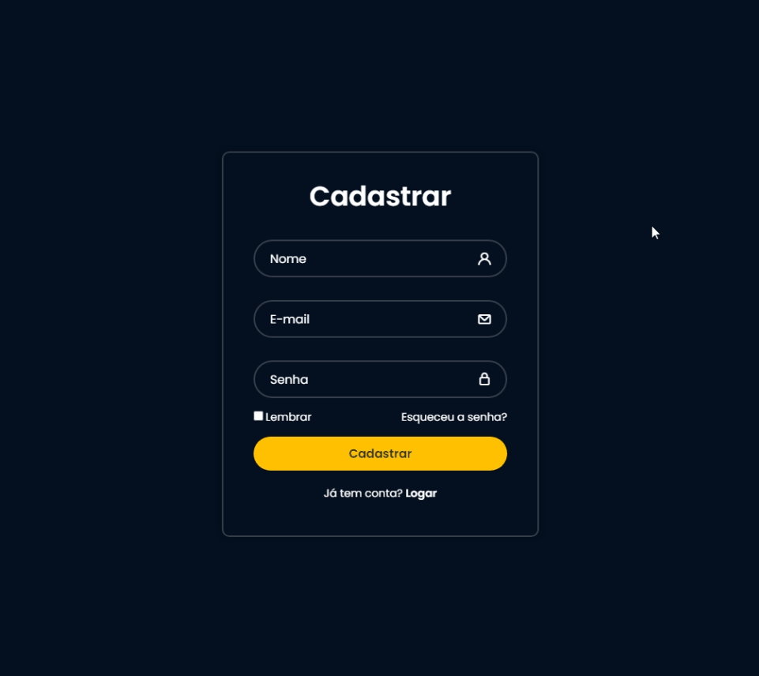
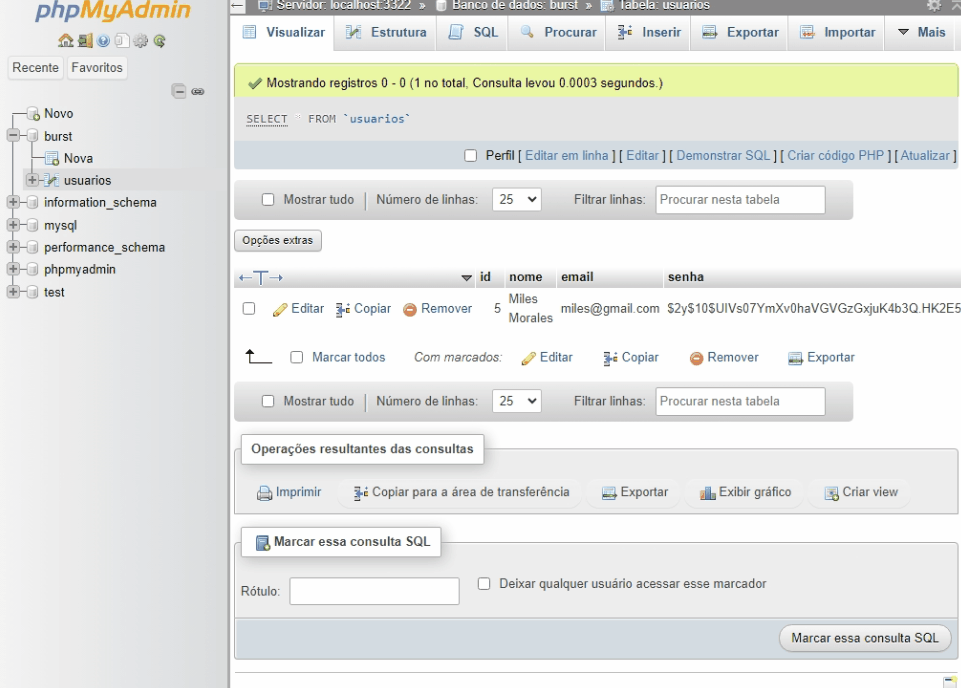
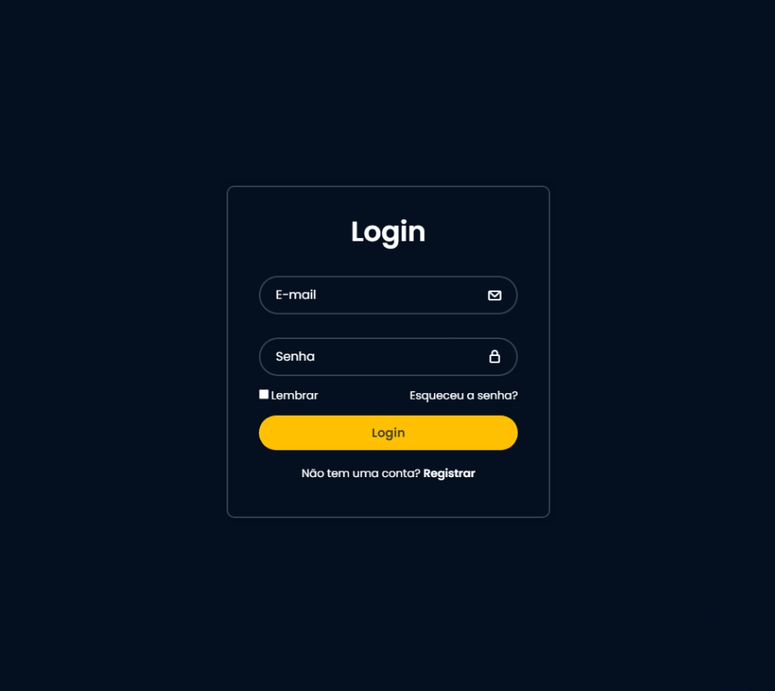
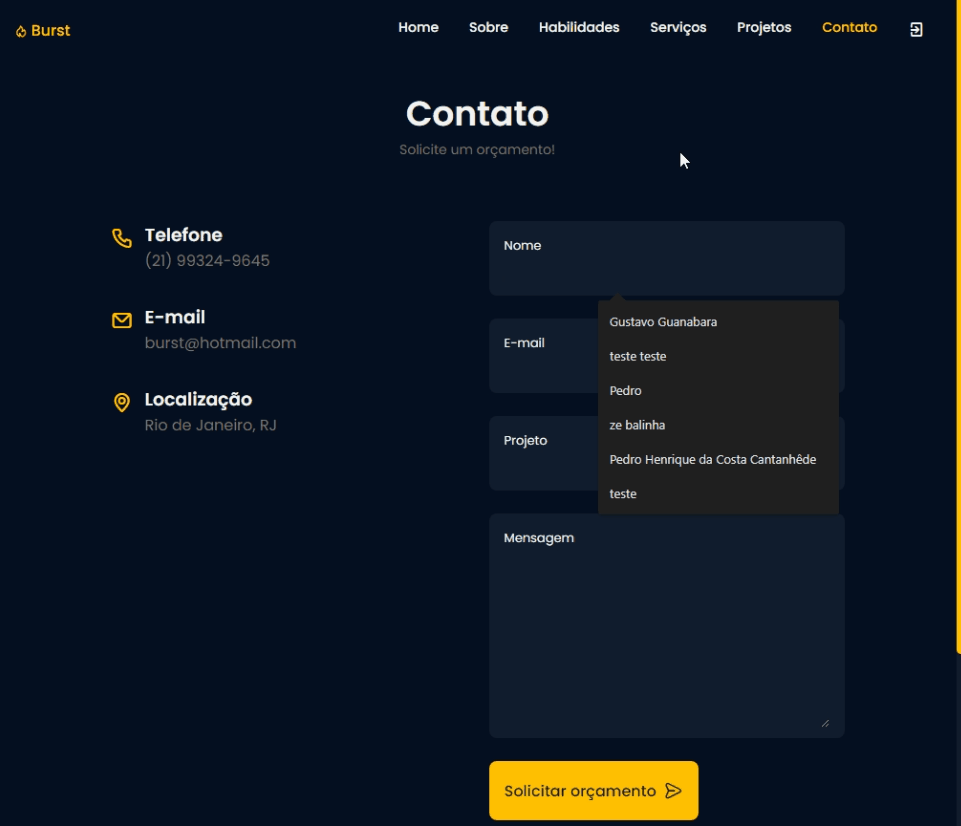
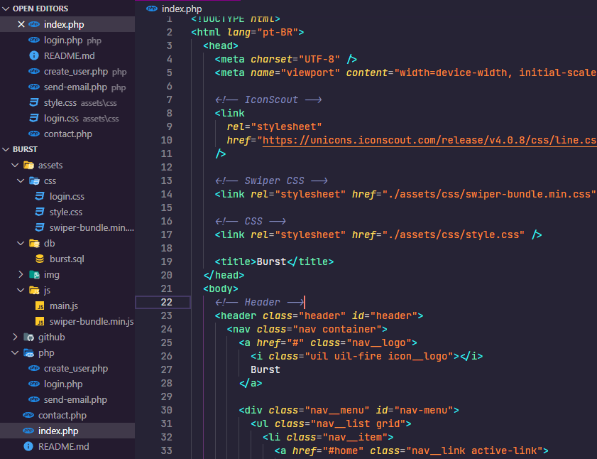

<h1 align="center">
    
</h1>

<div align="center">
    <h3> 🟡 Agência de Marketing Inteligente. 🟡 </h3>
    <a href="http://www.cefet-rj.br/" target="_blank">
      
    </a>
    <a href="https://github.com/PedroCantanhede" target="_blank">
      
    </a>
     
    
    
</div>

# Burst

Esse site foi desenvolvido na disciplina de desenvolvimento web do CEFET / RJ, minha faculdade. O objetivo principal do site é ajudar as empresas a alcançarem seus objetivos de marketing por meio de consultoria especializada e uma variedade deserviços personalizados.

<p align="center">
  
</p>

# 🔨 Tecnologias

💻 PHP

💻 JS

💻 MySQL

💻 HTML

💻 CSS

## :camera: Veja:

### Cadastro e Login





### Site


### Formulário de Contato




### Mobile (Responsividade)


### Estrutura do Projeto:



## :rocket: Instalação

```bash
# Primeiro é necessário instalar o xampp

# Depois de instalado, ative o Apache e o MySQL

# Clone o repositório na sua pasta xampp/htdocs
$ git clone https://github.com/PedroCantanhede/burst.git

# Acesse o phpMyAdmin e pronto!
```
## 💾 Banco de Dados

Você pode importar o banco de dados que fica no caminho '/assets/db/burst.sql'. Ele possui uma tabela usuarios, contendo id, nome, email e senha.

